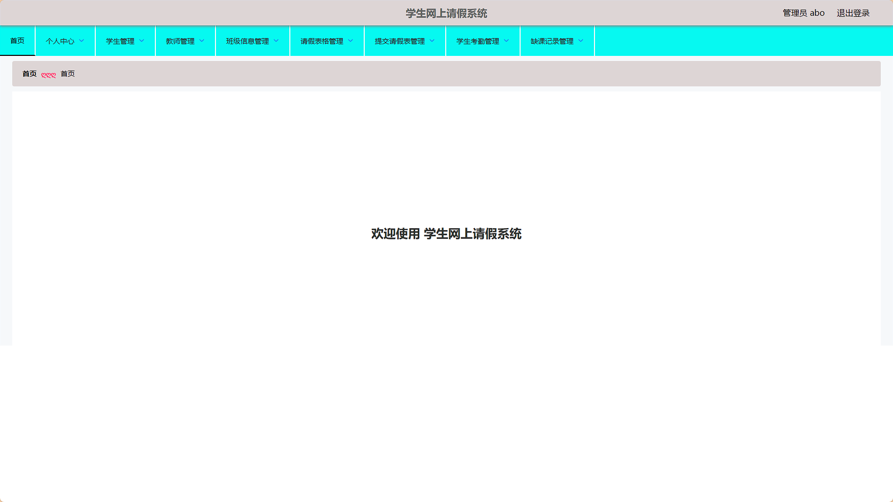
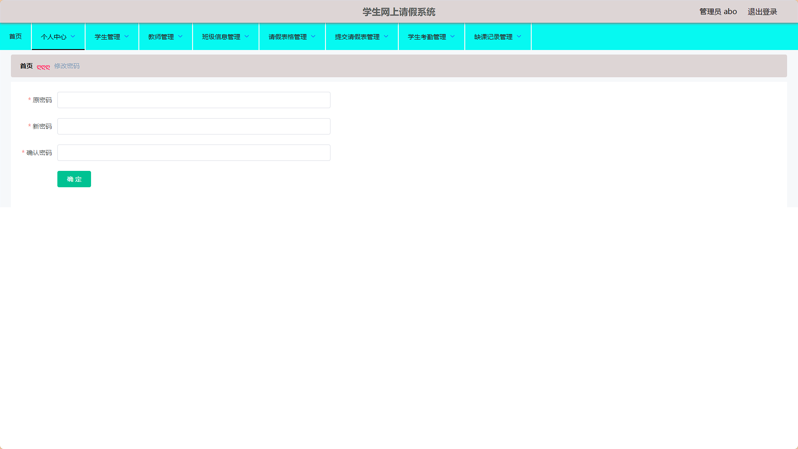
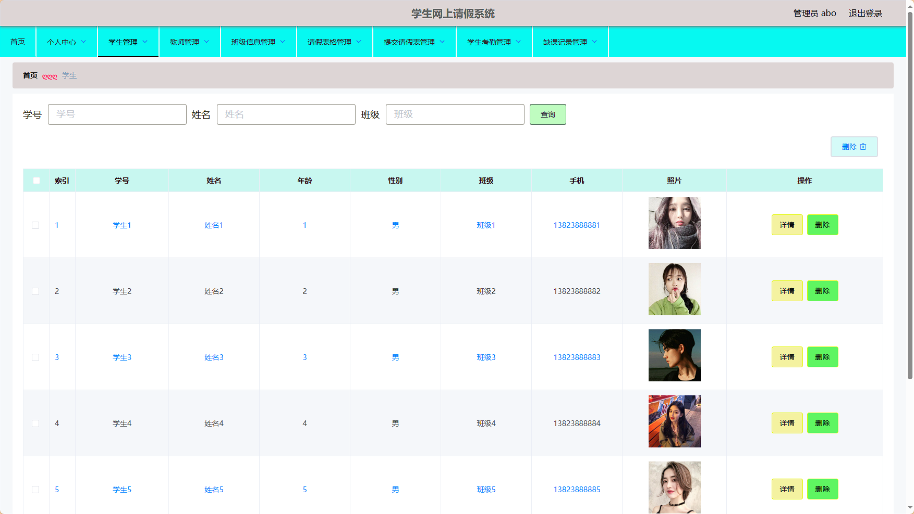
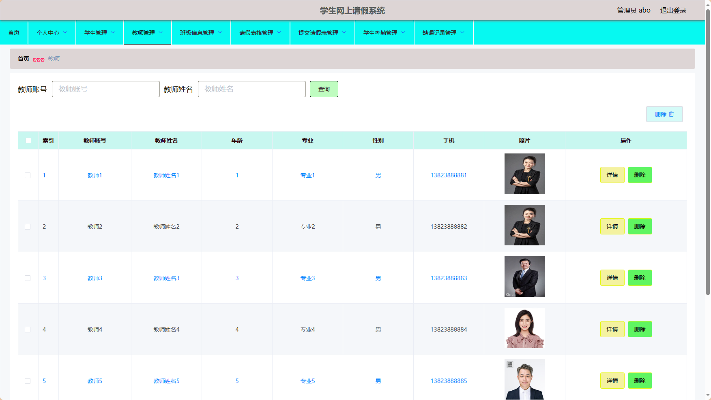
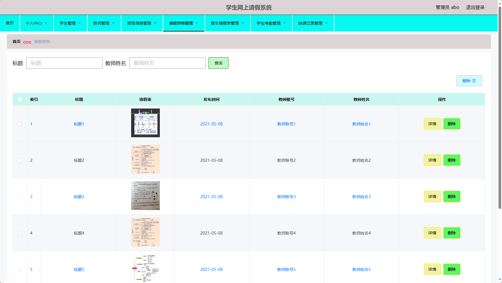
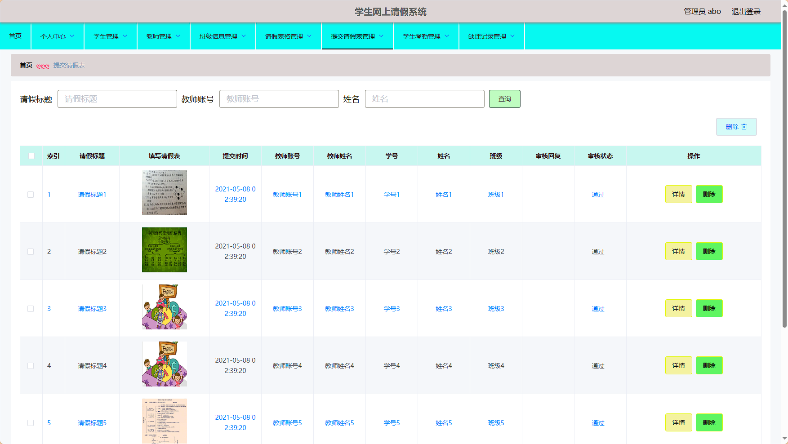
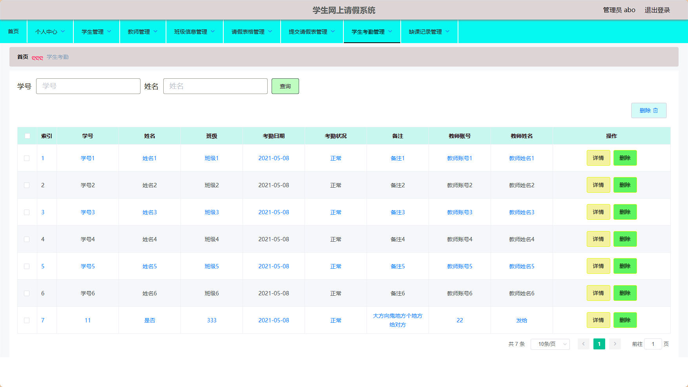
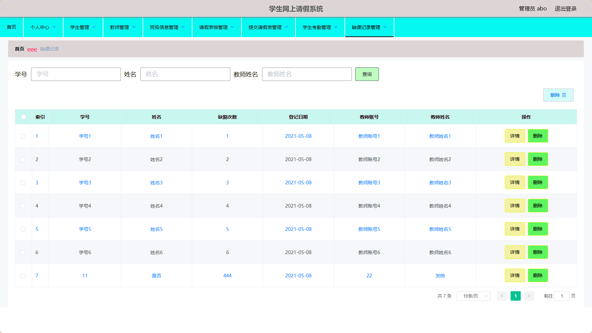
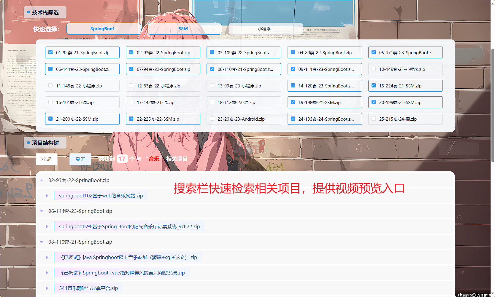
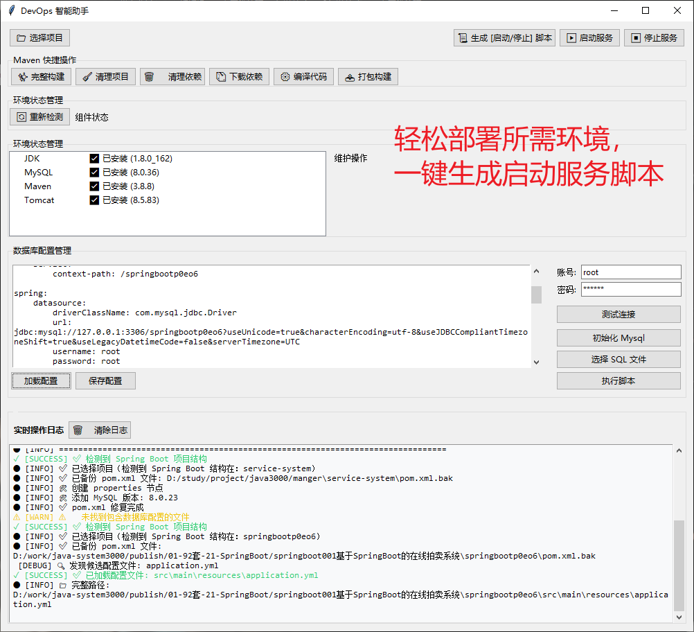

# springboot104学生网上请假系统设计与实现 / springboot104-Student_Online_Leave_System


 

> 更多毕设项目可跳转至项目导航栏检索：[毕设项目](http://sysadmin.3vfree.vip)，需要联系博主v：xq-lucky311，q：1047944234. 备注：项目咨询注：由于前端项目太大，仅上传了后端代码，未包含前端代码...

## 项目简介  
基于SpringBoot + MyBatis-Plus + Shiro的B/S架构学生请假管理系统，实现管理员、教师、学生的多角色权限控制，包含班级管理、请假审批、考勤记录等核心功能模块。

## 特征介绍  
- **权限控制**：集成Shiro实现三级角色权限分离（管理员/教师/学生），支持动态菜单权限管理。  
- **高效ORM**：MyBatis-Plus实现零SQL单表操作，内置分页插件JQPageInfo简化数据查询。  
- **文件处理**：通过FileUtil实现请假表附件上传，支持百度AI接口的智能校验功能。  
- **数据安全**：MD5加密存储敏感信息，AuthorizationInterceptor实现请求鉴权拦截。  
- **多端适配**：前后端分离架构，响应式界面兼容PC/移动端浏览器访问。  

## 代码结构 
```
src/
├── main/
│   ├── java/
│   │   ├── com/
│   │   │   ├── annotation/          # 权限注解
│   │   │   │   ├── LoginUser.java
│   │   │   │   ├── IgnoreAuth.java
│   │   │   ├── config/              # 全局配置
│   │   │   │   ├── MybatisPlusConfig.java
│   │   │   │   ├── InterceptorConfig.java
│   │   │   ├── controller/          # 接口层
│   │   │   │   ├── JiaoshiController.java
│   │   │   │   ├── QingjiabiaogeController.java
│   │   │   ├── entity/              # 数据模型
│   │   │   │   ├── JiaoshiEntity.java
│   │   │   │   ├── model/           # 业务模型
│   │   │   │   ├── vo/              # 视图对象
│   │   │   ├── interceptor/         # 请求拦截器
│   │   │   ├── service/             # 服务层
│   │   │   │   ├── impl/            # 服务实现
│   │   │   ├── utils/               # 工具类
│   │   │   │   ├── MD5Util.java
│   │   │   │   ├── FileUtil.java
│   ├── resources/
│   │   ├── mapper/                  # MyBatis映射文件
│   │   │   ├── QingjiabiaogeDao.xml
│   │   ├── application.yml          # 主配置
│   │   ├── static/                  # 静态资源
│   │   │   ├── upload/              # 文件存储
```
## 使用说明
1. 数据库配置：修改application.yml中的MySQL连接信息
   ```yaml
   url: jdbc:mysql://127.0.0.1:3306/springboot0e3m2
   username: root
   password: 123456
```
2. 默认管理员账号：abo/abo
3. 访问地址：http://localhost:8080/springboot0e3m2/admin/dist/index.html
4. 推荐使用Chrome浏览器访问
```
# 项目实际截图：

## 后台：










> 等等...

# 精选项目导航 & 快速部署工具
## 项目资源一站直达
- ​**访问项目导航站**：[点击进入](http://sysadmin.3vfree.vip)**快速检索所需项目名称**
- ​**技术栈全覆盖**：Java/SSm/Spring Boot/小程序等主流技术方案
- ​**配套资源**：每个项目均提供部署文档 + 演示视频（附效果截图）

### ▌导航站预览


### ▌工具界面预览


## 捐赠
> 博主将持续更新Java全栈开发项目，包含ssm，springboot，前后端分离系统等项目。
> 此外如果您够宽裕，请博主喝杯咖啡吧！捐赠将用于服务器维护与开源社区建设，感谢您的认可！
> 如需更多Java相关项目毕设3000+，有其他项目需求，sql文件等可联系博主v:xq-lucky311

---